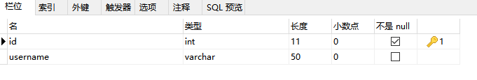
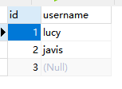

# MybatisLearing01快速入门

Github: [https://github.com/staySunshine/Mybatis-Learning](https://github.com/staySunshine/Mybatis-Learning)

Gitee:   [https://gitee.com/RoyalH/Mybatis-Learning](https://gitee.com/RoyalH/Mybatis-Learning)

## 目录

1. 创建工程修改pom.xml
2. 创建数据库表User
3. 创建User实体类
4. 编写映射文件UserMapper.xml
5. 编写核心文件SqlMapConfig.xml
6. 编写测试类

1. ### 创建工程修改pom.xml

   ```xml
       <!--引入依赖-->
       <dependencies>
           <!--mybatis坐标-->
           <dependency>
               <groupId>org.mybatis</groupId>
               <artifactId>mybatis</artifactId>
               <version>3.4.5</version>
           </dependency>
           <!--mysql驱动坐标-->
           <dependency>
               <groupId>mysql</groupId>
               <artifactId>mysql-connector-java</artifactId>
               <version>5.1.6</version>
               <scope>runtime</scope>
           </dependency>
           <!--单元测试坐标-->
           <dependency>
               <groupId>junit</groupId>
               <artifactId>junit</artifactId>
               <version>4.12</version>
           </dependency>
       </dependencies>
   ```

2. ### 创建数据库表User

   

   

3. ### 创建User实体类

   ```java
   public class User {
   
       private Integer id;
       
       private String username;
   
   	省略getter setter...
   }
   ```

   

4. ### 编写映射文件UserMapper.xml

   ```xml
   <mapper namespace="userMapper">
       <!--namespace : 名称空间：与id组成sql的唯一标识
           resultType： 表明返回值类型-->
   
       <select id="findAll" resultType="cn.xie.pojo.User">
          select * from user
       </select>
   
   </mapper>
   ```

   

   

5. ### 编写核心文件SqlMapConfig.xml

   ```xml
   <!--environments:运行环境-->
   <environments default="development">
       <environment id="development">
           <!--当前事务交由JDBC进行管理-->
           <transactionManager type="JDBC"/>
           <!--当前使用mybatis提供的连接池-->
           <dataSource type="POOLED">
               <property name="driver" value="com.mysql.jdbc.Driver"/>
               <property name="url" value="jdbc:mysql:///mybatis_learning"/>
               <property name="username" value="root"/>
               <property name="password" value="root"/>
           </dataSource>
       </environment>
   </environments>
   
   <!--引入映射配置文件-->
   <mappers>
       <mapper resource="cn/xie/mapper/UserMapper.xml"/>
   </mappers>
   ```
   

6. ### 编写测试类

```java
    @Test
    public void test() throws IOException {
        //1.Resources工具类，配置文件的加载，把配置文件加载成字节输入流
        InputStream resourceAsStream = Resources.getResourceAsStream("sqlMapConfig.xml");
        //2.解析了配置文件，并创建了sqlSessionFactory工厂
        SqlSessionFactory sqlSessionFactory = new SqlSessionFactoryBuilder().build(resourceAsStream);
        //3.生产sqlSession
        SqlSession sqlSession = sqlSessionFactory.openSession();// 默认开启一个事务，但是该事务不会自动提交
                                                                //在进行增删改操作时，要手动提交事务
        //4.sqlSession调用方法：查询所有selectList  查询单个：selectOne 添加：insert  修改：update 删除：delete
        List<User> userList = sqlSession.selectList("userMapper.findAll");
//        System.out.println(userList);
        for (User user : userList) {
            System.out.println(user);
        }
        sqlSession.close();
    }
```

## 入门至此结束

Github: [https://github.com/staySunshine/Mybatis-Learning](https://github.com/staySunshine/Mybatis-Learning)

Gitee:   [https://gitee.com/RoyalH/Mybatis-Learning](https://gitee.com/RoyalH/Mybatis-Learning)