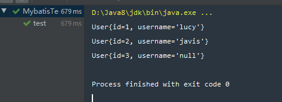
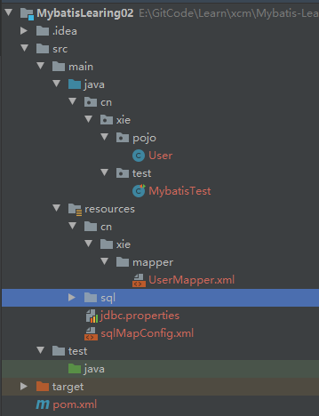

# MybatisLearing02核心配置文件SqlConfig

Github: [https://github.com/staySunshine/Mybatis-Learning](https://github.com/staySunshine/Mybatis-Learning)

Gitee:   [https://gitee.com/RoyalH/Mybatis-Learning](https://gitee.com/RoyalH/Mybatis-Learning)

## 目录

- 标签解释
- 创建工程修改pom.xml
- 创建数据库表User
- 创建User实体类
- 编写映射文件UserMapper.xml
- 编写核心文件SqlMapConfig.xml
- 编写测试类


## 理论部分

### 标签解释

- `properties`

  用于给加载外部的properties文件

  ```xml
  <!--加载外部的properties文件-->
  <properties resource="jdbc.properties"/>
  ```


- `typeAliases`

  用于给实体类的全限定类名给别名

  - `typeAlias`  给单独的实体起别名

  - `package`   给该包下所有的类的本身的类名(别名不区分大小写)

  ```xml
  <!--给实体类的全限定类名给别名-->
  <typeAliases>
      <!--给单独的实体起别名-->
        <typeAlias type="cn.xie.pojo.User" alias="user"></typeAlias>
      <!--批量起别名：该包下所有的类的本身的类名：别名还不区分大小写-->
      <!--<package name="cn.xie.pojo"/>-->
  </typeAliases>
  ```


- `environments`

  用于配置Mybatis运行环境

  - `environments`

    通过标签的default属性指定运行环境

   - `environment`

     该标签下描述了运环境具体的配置内容

     通过标签的id属性给该运行环境取唯一标识

     - `transactionManager`

       通过type属性指定了 MyBatis 中有两种类型的事务管理器（JDBC|MANAGED）

       - JDBC – 这个配置直接使用了 JDBC 的提交和回滚设施，它依赖从数据源获得的连接来管理事务作用域。
       - MANAGED – 这个配置几乎没做什么。

     - `dataSource`

       用于配置 JDBC 连接对象的资源

       通过type属性来指定数据源类型（数据源类型）

       - **UNPOOLED**– 这个数据源的实现会每次请求时打开和关闭连接。
       - **POOLED**– 这种数据源的实现利用“池”的概念将 JDBC 连接对象组织起来，避免了创建新的连接实例时所必需的初始化和认证时间，即使用数据池。
       - **JNDI** – 这个数据源实现是为了能在如 EJB 或应用服务器这类容器中使用，容器可以集中或在外部配置数据源，然后放置一个 JNDI 上下文的数据源引用。基本不用。

       `property`子标签通过name与value属性来配置相关数据源配置信息。

     ```xml
     <!--environments:运行环境-->
     <environments default="development">
         <environment id="development">
             <!--当前事务交由JDBC进行管理-->
             <transactionManager type="JDBC"/>
             <!--当前使用mybatis提供的连接池-->
             <dataSource type="POOLED">
                 <property name="driver" value="${jdbc.driver}"/>
                 <property name="url" value="${jdbc.url}"/>
                 <property name="username" value="${jdbc.username}"/>
                 <property name="password" value="${jdbc.password}"/>
             </dataSource>
         </environment>
     </environments>
     ```

  

- mappers

  用于定义 SQL 映射语句位置，共有四种实现方式。

  - 使用相对于类路径的资源引用

    通过`mapper`下`resource`属性指定

  - 使用完全限定资源定位符（URL）

    通过`mapper`下`url`属性指定

  - 使用映射器接口实现类的完全限定类名

    通过`mapper`下`class`属性指定

  - 将包内的映射器接口实现全部注册为映射器

    通过`package`下`name`属性指定

    ```xml
    <!--引入映射配置文件-->
    <mappers>
        <!-- 使用相对于类路径的资源引用 -->
        <mapper resource="cn/xie/mapper/UserMapper.xml"/>
    
        <!-- 使用完全限定资源定位符（URL） -->
        <!--<mapper url="file:///var/mapper/UserMapper.xml"/>-->
    
        <!-- 使用映射器接口实现类的完全限定类名 -->
        <!--<mapper class="cn.xie.mapper.UserMapper"/>-->
    
        <!-- 将包内的映射器接口实现全部注册为映射器 -->
        <!--<package name="cn.xie.mapper"/>-->
    </mappers>
    ```


## 实战部分

### 创建工程修改pom.xml 

```xml
<!--引入依赖-->
<dependencies>
    <!--mybatis坐标-->
    <dependency>
        <groupId>org.mybatis</groupId>
        <artifactId>mybatis</artifactId>
        <version>3.4.5</version>
    </dependency>
    <!--mysql驱动坐标-->
    <dependency>
        <groupId>mysql</groupId>
        <artifactId>mysql-connector-java</artifactId>
        <version>5.1.6</version>
        <scope>runtime</scope>
    </dependency>
    <!--单元测试坐标-->
    <dependency>
        <groupId>junit</groupId>
        <artifactId>junit</artifactId>
        <version>4.12</version>
    </dependency>
</dependencies>
```

### 创建数据库表User

表结构如下


数据如下


sql文件位于[https://github.com/staySunshine/Mybatis-Learning/tree/main/MybatisLearing02/src/main/resources/sql](https://github.com/staySunshine/Mybatis-Learning/tree/main/MybatisLearing02/src/main/resources/sql)


### 创建User实体类

```java
public class User {

    private Integer id;
    
    private String username;

	省略getter setter...
}
```


### 编写映射文件UserMapper.xml

由于我们在sqlMapConfig.xml文件中起了别名，顾此处`resultType`为`user`而不是全限定类名`cn.xie.pojo.User`

```xml
<mapper namespace="userMapper">
    <!--namespace : 名称空间：与id组成sql的唯一标识
        resultType： 表明返回值类型-->

    <!--查询用户-->
    <select id="findAll" resultType="user">
       select * from user
    </select>

</mapper>
```


### 编写核心文件SqlMapConfig.xml

我们在此文件中加重了外部的properties文件，并且给User实体对象起了别名

```xml
<configuration>

    <!--加载外部的properties文件-->
    <properties resource="jdbc.properties"/>

    <!--给实体类的全限定类名给别名-->
    <typeAliases>
        <!--给单独的实体起别名-->
          <typeAlias type="cn.xie.pojo.User" alias="user"></typeAlias>
        <!--批量起别名：该包下所有的类的本身的类名：别名还不区分大小写-->
        <!--<package name="cn.xie.pojo"/>-->
    </typeAliases>

    <!--environments:运行环境-->
    <environments default="development">
        <environment id="development">
            <!--当前事务交由JDBC进行管理-->
            <transactionManager type="JDBC"/>
            <!--当前使用mybatis提供的连接池-->
            <dataSource type="POOLED">
                <property name="driver" value="${jdbc.driver}"/>
                <property name="url" value="${jdbc.url}"/>
                <property name="username" value="${jdbc.username}"/>
                <property name="password" value="${jdbc.password}"/>
            </dataSource>
        </environment>
    </environments>

    <!--引入映射配置文件-->
    <mappers>
        <!-- 使用相对于类路径的资源引用 -->
        <mapper resource="cn/xie/mapper/UserMapper.xml"/>

        <!-- 使用完全限定资源定位符（URL） -->
        <!--<mapper url="file:///var/mapper/UserMapper.xml"/>-->

        <!-- 使用映射器接口实现类的完全限定类名 -->
        <!--<mapper class="cn.xie.mapper.UserMapper"/>-->

        <!-- 将包内的映射器接口实现全部注册为映射器 -->
        <!--<package name="cn.xie.mapper"/>-->
    </mappers>

</configuration>
```

### 编写测试类

```java
    @Test
    public void test() throws IOException {
        //1.Resources工具类，配置文件的加载，把配置文件加载成字节输入流
        InputStream resourceAsStream = Resources.getResourceAsStream("sqlMapConfig.xml");
        //2.解析了配置文件，并创建了sqlSessionFactory工厂
        SqlSessionFactory sqlSessionFactory = new SqlSessionFactoryBuilder().build(resourceAsStream);
        //3.生产sqlSession
        SqlSession sqlSession = sqlSessionFactory.openSession();// 默认开启一个事务，但是该事务不会自动提交
                                                                //在进行增删改操作时，要手动提交事务
        //4.sqlSession调用方法：查询所有selectList  查询单个：selectOne 添加：insert  修改：update 删除：delete
        List<User> userList = sqlSession.selectList("userMapper.findAll");
//        System.out.println(userList);
        for (User user : userList) {
            System.out.println(user);
        }
        sqlSession.close();
    }
```

测试结果如下：



### 项目结构如下，可供参考：



## 本篇至此结束，本项目相关代码位于

Github: [https://github.com/staySunshine/Mybatis-Learning](https://github.com/staySunshine/Mybatis-Learning)

Gitee:   [https://gitee.com/RoyalH/Mybatis-Learning](https://gitee.com/RoyalH/Mybatis-Learning)