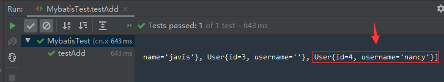

# MybatisLearing03映射配置文件SqlMapConfig.xml之CURD

Github: [https://github.com/staySunshine/Mybatis-Learning](https://github.com/staySunshine/Mybatis-Learning)

Gitee:   [https://gitee.com/RoyalH/Mybatis-Learning](https://gitee.com/RoyalH/Mybatis-Learning)

## 目录

- 理论内容:标签解释(`mapper` `sql` `insert` `update` `delete` `select`)
- 创建工程修改pom.xml
- 创建数据库表User
- 创建User实体类
- 编写映射文件UserMapper.xml
- 编写核心文件SqlMapConfig.xml
- 编写测试类

## 理论内容

### 标签解释

- `mapper` 

  `mapper` 的`namespace`属性为名称空间，它与与id组成sql的唯一标识。

  ```xml
  <mapper namespace="userMapper">
      <!--namespace : 名称空间：与id组成sql的唯一标识
          resultType： 表明返回值类型-->
  </mapper>
  ```

- `parameterType`

  此标签为申明参数类型

  

- `sql` 

  用于抽取sql片段，在其他地方使用`include`来进行引用。

  ```xml
      <!--抽取sql片段-->
      <sql id="selectUser">
           select * from user
      </sql>
      <insert id="addUser" parameterType="user" >
          insert into user values(#{id},#{username})
      </insert>
  ```

  

- `select`

  用于包含查询sql语句

  ```xml
      <select id="findAll" resultType="user">
          select * from user
      </select>
  ```

  

- `insert` 

  用于包含插入sql语句

  ```xml
      <insert id="addUser" parameterType="user" >
          insert into user values(#{id},#{username})
      </insert>
  ```

  

- `update` 

  用于包含更新sql语句

  ```xml
      <update id="updateUser" parameterType="user">
          update user set username = #{username} where id = #{id}
      </update>
  ```

  

- `delete` 

  用于包含删除sql语句

  ```xml
      <delete id="deleteUser" parameterType="int">
          delete from user where id = #{xxx}
      </delete>
  ```

  

### 创建工程修改pom.xml

```xml
    <!--引入依赖-->
    <dependencies>
        <!--mybatis坐标-->
        <dependency>
            <groupId>org.mybatis</groupId>
            <artifactId>mybatis</artifactId>
            <version>3.4.5</version>
        </dependency>
        <!--mysql驱动坐标-->
        <dependency>
            <groupId>mysql</groupId>
            <artifactId>mysql-connector-java</artifactId>
            <version>5.1.6</version>
            <scope>runtime</scope>
        </dependency>
        <!--单元测试坐标-->
        <dependency>
            <groupId>junit</groupId>
            <artifactId>junit</artifactId>
            <version>4.12</version>
        </dependency>
    </dependencies>
```

### 创建数据库表User

表结构如下


数据如下


sql文件位于[https://github.com/staySunshine/Mybatis-Learning/tree/main/MybatisLearing01/src/main/resources/sql](https://github.com/staySunshine/Mybatis-Learning/tree/main/MybatisLearing01/src/main/resources/sql)


### 创建User实体类

```java
public class User {

    private Integer id;
    
    private String username;

	省略getter setter...
}
```


### 编写映射文件UserMapper.xml

```xml
<mapper namespace="userMapper">
    <!--namespace : 名称空间：与id组成sql的唯一标识
        resultType： 表明返回值类型-->

    <!--抽取sql片段-->
    <sql id="selectUser">
         select * from user
    </sql>

    <!--添加用户-->
    <!--parameterType：参数类型-->
    <insert id="addUser" parameterType="user" >
        insert into user values(#{id},#{username})
    </insert>

    <!--修改-->
    <update id="updateUser" parameterType="user">
        update user set username = #{username} where id = #{id}
    </update>

    <!--删除-->
    <delete id="deleteUser" parameterType="int">
        delete from user where id = #{xxx}
    </delete>

    <!--查询-->
    <select id="findAllIncludeSql" resultType="user">
        <include refid="selectUser"></include>
    </select>
</mapper>
```


### 编写核心文件SqlMapConfig.xml

```xml
    <!--加载外部的properties文件-->
    <properties resource="jdbc.properties"/>

    <!--给实体类的全限定类名给别名-->
    <typeAliases>
        <!--给单独的实体起别名-->
          <typeAlias type="cn.xie.pojo.User" alias="user"></typeAlias>
        <!--批量起别名：该包下所有的类的本身的类名：别名还不区分大小写-->
        <!--<package name="cn.xie.pojo"/>-->
    </typeAliases>

    <!--environments:运行环境-->
    <environments default="development">
        <environment id="development">
            <!--当前事务交由JDBC进行管理-->
            <transactionManager type="JDBC"/>
            <!--当前使用mybatis提供的连接池-->
            <dataSource type="POOLED">
                <property name="driver" value="${jdbc.driver}"/>
                <property name="url" value="${jdbc.url}"/>
                <property name="username" value="${jdbc.username}"/>
                <property name="password" value="${jdbc.password}"/>
            </dataSource>
        </environment>
    </environments>

    <!--引入映射配置文件-->
    <mappers>
        <!-- 使用相对于类路径的资源引用 -->
        <mapper resource="UserMapper.xml"/>
    </mappers>
```

### 编写测试类

#### 测试代码运行前执行代码

```java
    @Before
    public void setUp() throws IOException {
        //1.Resources工具类，配置文件的加载，把配置文件加载成字节输入流
        InputStream resourceAsStream = Resources.getResourceAsStream("sqlMapConfig.xml");
        //2.解析了配置文件，并创建了sqlSessionFactory工厂
        SqlSessionFactory sqlSessionFactory = new SqlSessionFactoryBuilder().build(resourceAsStream);
        //3.生产sqlSession
        sqlSession = sqlSessionFactory.openSession();// 默认开启一个事务，但是该事务不会自动提交
        //在进行增删改操作时，要手动提交事务
    }
```


#### 测试代码运行后执行代码

```java
    @After
    public void closeUp(){
        sqlSession.close();
    }
```


#### 测试插入

```java
    @Test
    public void testAdd() throws IOException {
        User user = new User();
        user.setId(4);
        user.setUsername("nancy");
        //插入 insert
        sqlSession.insert("userMapper.addUser",user);
        sqlSession.commit();
        //查询selectList selectOne
        List<User> userList = sqlSession.selectList("userMapper.findAllIncludeSql");
        System.out.println(userList);

    }
```

​	测试结果




#### 测试更新

```java
    @Test
    public void testUpdate() throws IOException {
        User user = new User();
        user.setId(3);
        user.setUsername("zhangsan");
        //更新：update
        sqlSession.update("userMapper.updateUser",user);
        sqlSession.commit();

        //s查询selectList selectOne 修改：update
        List<User> userList = sqlSession.selectList("userMapper.findAllIncludeSql");
        System.out.println(userList);

    }
```

​	测试结果


#### 测试删除

```java
    @Test
    public void testDelete(){
        //删除：delete
        sqlSession.delete("userMapper.deleteUser",4);
        sqlSession.commit();

        //查询selectList selectOne
        List<User> userList = sqlSession.selectList("userMapper.findAllIncludeSql");
        System.out.println(userList);
    }
```

​	测试结果


### 项目结构如下，可供参考：


## 本篇至此结束，本项目相关代码位于

Github: [https://github.com/staySunshine/Mybatis-Learning](https://github.com/staySunshine/Mybatis-Learning)

Gitee:   [https://gitee.com/RoyalH/Mybatis-Learning](https://gitee.com/RoyalH/Mybatis-Learning)